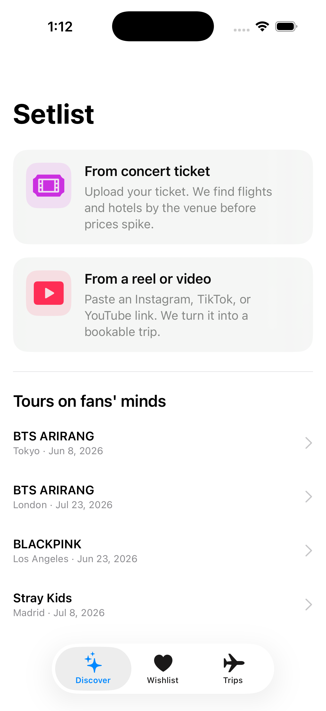
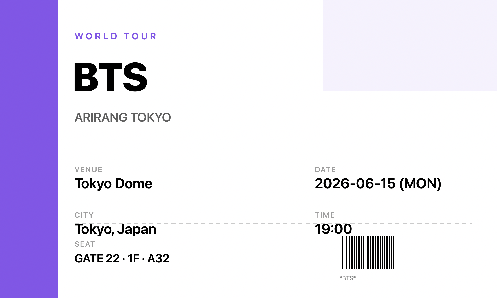
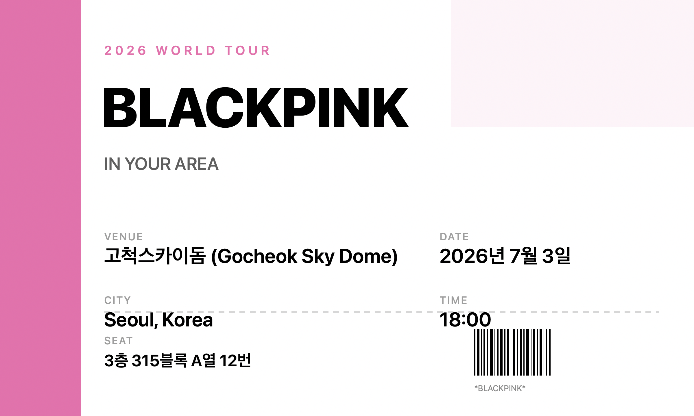
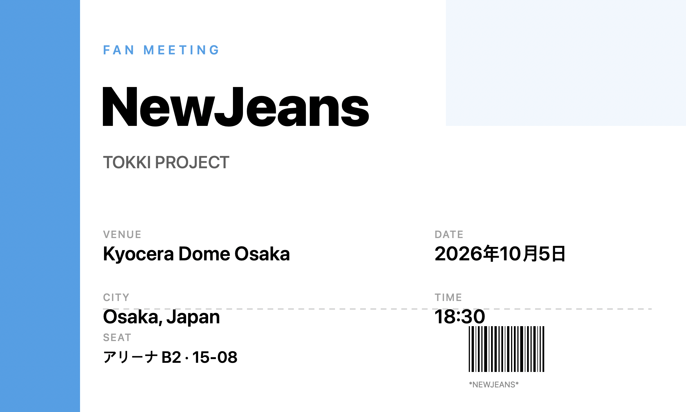
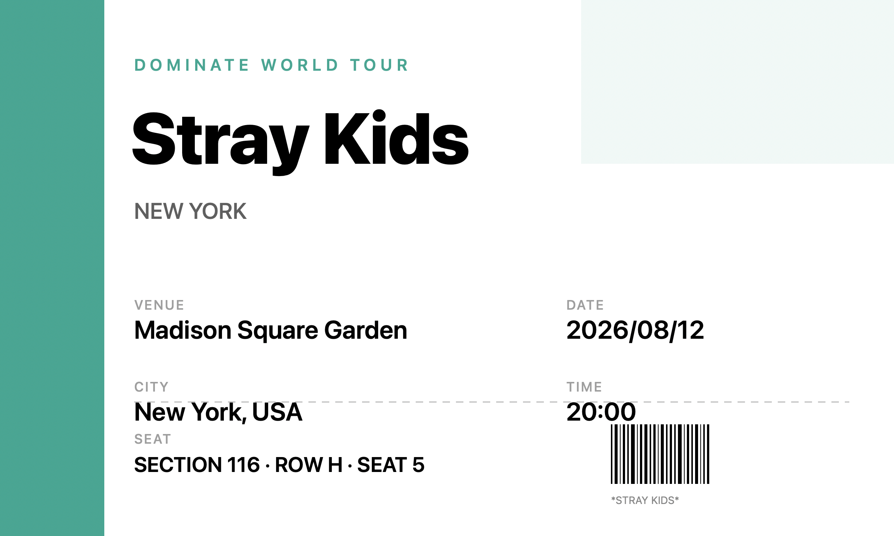

# Setlist — 실제 사용 가이드

이 문서는 Setlist 앱을 실제로 써보기 위한 **시나리오별 입력 데이터**와 **더미 자료**를 제공합니다. 앱 빌드가 끝났다면 이 문서의 텍스트를 그대로 복사해 `Concert trip` / `Reel to trip` 입력창에 붙여넣고 동작을 확인할 수 있습니다.

---

## 목차

1. [사전 준비](#사전-준비)
2. [시나리오 A — 콘서트 티켓 텍스트 입력](#시나리오-a--콘서트-티켓-텍스트-입력)
3. [시나리오 B — 콘서트 티켓 이미지 업로드](#시나리오-b--콘서트-티켓-이미지-업로드)
4. [시나리오 C — 릴스/비디오 URL 붙여넣기](#시나리오-c--릴스비디오-url-붙여넣기)
5. [시나리오 D — 트렌딩 투어 카드 탭](#시나리오-d--트렌딩-투어-카드-탭)
6. [시나리오 E — 위시리스트 · 예약 내역](#시나리오-e--위시리스트--예약-내역)
7. [시나리오 F — 수입(커미션) API 검증](#시나리오-f--수입커미션-api-검증)
8. [시나리오 G — TNA 상세 in-app 탐색](#시나리오-g--tna-상세-in-app-탐색)
9. [시나리오 H — Discover 트렌딩 (실시간 최저가)](#시나리오-h--discover-트렌딩-실시간-최저가)
10. [시나리오 I — MCP 서버 연결](#시나리오-i--mcp-서버-연결)
11. [시나리오 J — 사용자별 예약 추적 (BookingIntent)](#시나리오-j--사용자별-예약-추적-bookingintent)
11. [파서가 지원하는 것 · 못하는 것](#파서가-지원하는-것--못하는-것)
12. [테스트 데이터 일람](#테스트-데이터-일람)

---

## 사전 준비

### 1) MRT 파트너 API 키를 Keychain에 저장
```bash
security add-generic-password \
  -a "$USER" \
  -s "myrealtrip-partner-api" \
  -l "MyRealTrip Partner API Key" \
  -w "YOUR_MRT_PARTNER_KEY"
```

### 2) Xcode에서 빌드 & 실행
- `Setlist.xcodeproj` 열기 → Cmd+R
- 빌드 스크립트가 Keychain에서 키를 읽어 `Secrets.plist`로 자동 주입합니다
- 키가 없으면 자동으로 mock 데이터 모드로 돌아가서 플로우 자체는 그대로 동작합니다

### 3) 홈 화면 확인


두 개의 히어로 카드 + 트렌딩 투어 리스트가 보이면 OK.

---

## 시나리오 A — 콘서트 티켓 텍스트 입력

> **상황**: 팬이 텍스트로 받은 티켓 정보를 그대로 붙여넣고 싶다.
> **플로우**: Home → `From concert ticket` 탭 → `Or paste ticket details` 박스에 붙여넣기 → `Build trip`

### A-1. BTS · 도쿄돔 (영어 표기)
```
BTS WORLD TOUR
ARIRANG TOKYO
Tokyo Dome
2026-06-15 19:00
```
**기대 결과**
- artist = `BTS`
- venue = `Tokyo Dome` (lat 35.7056, lng 139.7519)
- city = `Tokyo`, country = `Japan`
- showDate = `2026-06-15 19:00 KST`
- 번들: 6/14 출발, 6/16 귀국, 2박 3일, ICN → NRT

### A-2. BLACKPINK · 고척스카이돔 (한글)
```
블랙핑크 WORLD TOUR
고척스카이돔
2026년 7월 3일 18시
```
**기대 결과**
- artist = `BLACKPINK`
- venue = `Gocheok Sky Dome`, city = `Seoul`
- showDate = `2026-07-03 18:00 KST`

### A-3. NewJeans · 오사카 교세라돔 (일본어 포맷)
```
뉴진스 Fan Meeting
Kyocera Dome Osaka
2026年10月5日 18:30
```
**기대 결과**
- artist = `NewJeans`
- venue = `Kyocera Dome Osaka`, city = `Osaka`
- showDate = `2026-10-05 18:30 KST`

### A-4. Stray Kids · MSG 뉴욕
```
Stray Kids DOMINATE WORLD TOUR
Madison Square Garden
2026/08/12 20:00
Section 116 Row H Seat 5
```
**기대 결과**
- artist = `Stray Kids`
- venue = `Madison Square Garden`, city = `New York`
- showDate = `2026-08-12 20:00 KST`
- 번들: ICN → JFK

### A-5. 날짜/장소만 있는 최소 입력 (edge case)
```
콘서트
2026.09.20
```
**기대 결과**
- artist = `Concert` (감지 실패 시 기본값)
- city = `Tokyo` (기본값), showDate = 2026-09-20 19:00
- 파서가 불완전한 입력에도 번들을 만들어 주는지 확인하는 용도

---

## 시나리오 B — 콘서트 티켓 이미지 업로드

> **상황**: 종이 티켓을 찍거나 스크린샷한 이미지를 올린다.
> **플로우**: Home → `From concert ticket` → `Choose ticket image` → 사진 선택 → `Build trip`

iOS Vision framework(`VNRecognizeTextRequest`)가 한/영/일 동시 인식합니다. 아래 더미 티켓 이미지를 시뮬레이터로 끌어 Photos 앱에 넣은 뒤 선택하면 됩니다.

### 시뮬레이터에 이미지 드래그 방법
1. 시뮬레이터 실행
2. `docs/tickets/ticket_*.png` 파일을 시뮬레이터 창 위로 드래그
3. 자동으로 Photos 앱이 열리고 사진이 저장됨
4. 앱으로 돌아와서 사진 선택

### B-1. BTS · Tokyo Dome


### B-2. BLACKPINK · 고척스카이돔


### B-3. NewJeans · Kyocera Dome Osaka


### B-4. Stray Kids · Madison Square Garden


네 장 모두 `docs/tickets/` 밑에 있으며 `scripts/gen_tickets.swift`로 언제든 재생성할 수 있습니다:
```bash
swift scripts/gen_tickets.swift
```

---

## 시나리오 C — 릴스/비디오 URL 붙여넣기

> **상황**: SNS/유튜브에서 본 여행 콘텐츠를 여행 번들로 바꾸고 싶다.
> **플로우**: Home → `From a reel or video` → URL 붙여넣기 → `Turn into trip`

앱이 해당 URL을 직접 fetch → HTML의 `og:title` / `og:description` / `<title>` 태그를 파싱 → City DB 매칭.

### C-1. YouTube Shorts (OG 태그 잘 열림 · 추천)
```
https://www.youtube.com/shorts/vFZ-Jt2rDKE
```
(또는 여행 vlog 쇼츠 어떤 URL이든. YouTube는 OG 태그를 공개적으로 제공)

### C-2. YouTube 일반 영상 (예: 유후인 여행)
```
https://www.youtube.com/results?search_query=%EC%9C%A0%ED%9B%84%EC%9D%B8+%EC%97%AC%ED%96%89
```
검색 결과 중 제목에 `유후인` 이 들어간 영상 아무 링크나 붙여넣기 → `Yufuin, Japan`으로 감지되어야 함.

### C-3. 공개 블로그 포스트
```
https://en.wikipedia.org/wiki/Tokyo
```
Wikipedia 같은 공개 페이지는 OG/title 태그가 확실하게 존재 → `Tokyo` 감지 확실. 파서 동작 확인용.

### C-4. Instagram 릴스 URL (제약 시연용)
```
https://www.instagram.com/reel/DAbc123Xyz/
```
Instagram은 비로그인 요청에 OG 태그를 거의 제공하지 않음 → fetch 실패 → **Tokyo 기본값 fallback**으로 번들 생성. 파서의 fallback 경로를 확인하는 용도.

### 테스트 팁
- URL은 `https://` 프리픽스 필수 (없으면 `Turn into trip` 버튼 비활성화)
- fetch 타임아웃 8초 → 느린 URL은 빠르게 실패하고 기본값으로 진행

---

## 시나리오 D — 트렌딩 투어 카드 탭

> **상황**: 홈 화면의 "Tours on fans' minds" 리스트에서 관심 있는 투어를 바로 탭.
> **플로우**: Home → 하단 투어 row 탭 → ConcertImportView가 "아티스트, 도시, 날짜" 프리필된 채로 열림 → `Build trip`

데이터는 `HomeView.swift`의 `UpcomingTour.samples`에 하드코딩돼 있습니다:

| 아티스트        | 도시           | 출발 기준일            |
|:---------------|:--------------|:---------------------|
| BTS ARIRANG    | Tokyo         | +45일                |
| BTS ARIRANG    | London        | +90일                |
| BLACKPINK      | Los Angeles   | +60일                |
| Stray Kids     | Madrid        | +75일                |

실데이터로 바꾸려면 Ticketmaster/인터파크 크롤링으로 `UpcomingTour.samples`를 교체하면 됩니다 (README의 "Next moves" 5번).

---

## 시나리오 E — 위시리스트 · 예약 내역

### E-1. 위시리스트 저장
1. 번들 상세 화면(`BundleDetailView`)에서 `Save to wishlist` 탭
2. 탭바 → `Wishlist` → 저장된 번들이 날짜순으로 보임
3. 셀 탭하면 번들 상세로 다시 진입 (SwiftData에서 JSON 디코딩)
4. 스와이프 → 삭제

### E-2. 예약 내역 (MRT 파트너 실데이터)
1. 탭바 → `Trips`
2. MRT API 키가 있으면 `/v1/reservations` 자동 호출 (지난 6개월)
3. 앱에서 `Book on MyRealTrip`으로 열어본 링크들은 **Opened from this device** 섹션, 실제 MRT에서 완료된 예약들은 **From MyRealTrip** 섹션
4. Pull-to-refresh로 수동 갱신
5. 키가 없으면 안내 메시지만 표시

### E-3. 실제 커미션 테스트
1. `Book on MyRealTrip` 탭 → 파트너 링크(`myrealt.rip/xxx`) 자동 생성되어 브라우저 열림
2. MRT 파트너 페이지 → 마이링크 목록에 방금 생성된 링크가 기록됨
3. 실제로 해당 링크로 결제가 일어나면 7% 커미션 귀속

---

## 시나리오 F — 수입(커미션) API 검증

> **상황**: 내가 뿌린 mylink로 누군가 예약을 완료하면 MRT가 7% 커미션을 귀속시킨다. 앱의 `Revenue` 탭은 `/v1/revenues` + `/v1/revenues/flight`를 호출해서 이 수입을 집계한다.
> **목표**: 데이터가 실제로 들어오는지, 어느 mylink에서 왔는지, 정산 타이밍이 어떻게 도는지 전부 점검.

### F-1. 앱에서 실시간 확인 (가장 편함)
1. 탭바 → `Revenue`
2. 상단 hero 카드에 **총 커미션 / 총 판매액 / 평균 rate / 건수** 표시
3. 기간 세그먼트: `7d / 30d / 90d`
4. 날짜 기준 세그먼트:
   - `Booking date` (= MRT의 `PAYMENT`): 예약이 일어난 날 기준
   - `Settlement` (= `SETTLEMENT`): MRT가 정산 처리한 날 기준 (매일 6AM KST)
5. Pull-to-refresh or 우상단 새로고침 버튼
6. 파트너 키가 없으면 Mock 데이터가 뜸 (USJ 티켓 / 신주쿠 호텔 예시 2건)

### F-2. Curl로 바로 서버 응답 확인

**준비**: Keychain에 `myrealtrip-partner-api` 엔트리가 있어야 함.
```bash
export MRT_KEY=$(security find-generic-password -a "$USER" -s "myrealtrip-partner-api" -w)
```

**일반 상품 수익 (TNA + 숙소) · 최근 30일 예약 기준**
```bash
START=$(date -v-30d +%Y-%m-%d)
END=$(date +%Y-%m-%d)
curl -sS -H "Authorization: Bearer $MRT_KEY" \
  "https://partner-ext-api.myrealtrip.com/v1/revenues?dateSearchType=PAYMENT&startDate=$START&endDate=$END" \
  | python3 -m json.tool | head -40
```

**항공 상품 수익 · 최근 30일 정산 기준**
```bash
curl -sS -H "Authorization: Bearer $MRT_KEY" \
  "https://partner-ext-api.myrealtrip.com/v1/revenues/flight?dateSearchType=SETTLEMENT&startDate=$START&endDate=$END" \
  | python3 -m json.tool | head -40
```

**성공 응답 형태**
```json
{
  "data": [
    {
      "linkId": "1000001",
      "reservationNo": "TNA-20260415-00001234",
      "salePrice": 150000,
      "commissionBase": 147000,
      "commission": 10290,
      "commissionRate": 0.07,
      "settlementCriteriaDate": "2026-04-16",
      "utmContent": "reel-parser",
      "closingType": "결제완료",
      "productTitle": "도쿄 돈키호테 할인쿠폰",
      "productCategory": "TICKET",
      "status": "CONFIRM", "statusKor": "예약확정",
      "city": "Tokyo", "country": "Japan"
    }
  ],
  "meta": { "totalCount": 1 },
  "result": { "status": 200, "message": "SUCCESS", "code": "success" }
}
```

**계정이 새거라 data=[]인 경우 (정상)**
```json
{ "data": [], "meta": { "totalCount": 0 }, "result": { "status": 200, ... } }
```
→ 인증은 통과, 아직 commissionable 예약이 없다는 뜻. F-3으로.

### F-3. End-to-end 커미션 귀속 테스트 (실돈 1개 예약)

가장 확실한 검증. 싼 TNA 상품(₩10k 이하) 하나 골라서 실제로 결제해 본다.

1. **앱**에서 `Discover → From concert ticket → 도쿄 티켓 텍스트 입력 → Build trip`
   - 또는 홈 트렌딩 `BTS ARIRANG · Tokyo` 탭 (즉시 번들 빌드됨 = 심리스 플로우)
2. 번들 하단 `Book all` (또는 특정 activity row 탭)
   - Safari가 `myrealt.rip/<shortcode>` 로 열림 → MRT 상세 페이지로 리다이렉트
3. URL에 `?mylink_id=...&utm_content=...` 붙어있는지 확인 (파트너 귀속 파라미터)
4. **이 상태에서 MRT 앱/웹에서 실제로 결제 완료**
5. 예약 즉시 `/v1/reservations`에 나타남:
   ```bash
   curl -sS -H "Authorization: Bearer $MRT_KEY" \
     "https://partner-ext-api.myrealtrip.com/v1/reservations?dateSearchType=RESERVATION_DATE&startDate=$START&endDate=$END&pageSize=10" \
     | python3 -m json.tool | head -40
   ```
   → 앱 `Trips` 탭에서도 수동 새로고침 시 "From MyRealTrip" 섹션에 반영
6. 다음 날 오전 6시 KST 이후 `/v1/revenues`에 커미션이 정산되어 등장:
   - 예약 당일 → `/v1/reservations`: 예약확정 상태 ✓, `/v1/revenues`: 아직 없음
   - 다음날 06:00 이후 → `/v1/revenues`: `commission` 필드에 금액 붙음
7. 앱 `Revenue` 탭 `Settlement` 세그먼트로 전환하면 보임

### F-4. 환불/취소 시나리오
- 예약을 취소하면 같은 `reservationNo`로 `commission`이 **음수**로 갱신되어 반환됨 (`closingType: "환불완료"`)
- `Revenue` 탭의 hero 숫자는 음수 건도 합산하므로 실제 정산 금액과 일치
- 앱 UI에서는 `+₩XXX` 가 빨간색으로 변함 (음수 처리)

### F-5. utmContent로 유입 추적
- 앱에서 `generateMyLink(targetURL:)` 호출 전에 URL에 `?utm_content=<라벨>` 을 붙이면 (코드 개선 여지)
- `/v1/revenues` 응답에 그 라벨이 그대로 내려와서 어떤 유입(콘서트 플로우 / 릴스 플로우 / 특정 아티스트 팬덤)에서 왔는지 집계 가능
- 현재는 라벨이 붙지 않음 → 추가하려면 `MRTClient.generateMyLink` 시그니처에 `utmContent: String?` 추가하고 `BundleDetailView.openBooking`이 source별 라벨 전달

### F-6. 체크리스트

| 검증 항목 | 어디서 확인 | 기대값 |
|:--------|:----------|:------|
| Bearer 인증 통과 | `curl .../v1/revenues` 또는 `Revenue` 탭 | HTTP 200, `result.status=200` |
| 파트너 tier 접근권한 | 응답 `result.code` | `"success"` (403 아니면 OK) |
| 최초 계정 (예약 0건) | `/v1/revenues` | `data: [], totalCount: 0` |
| 예약 발생 후 | `/v1/reservations` | 즉시 반영 |
| 정산 후 커미션 | `/v1/revenues` (다음날 6AM+) | `commission > 0`, `commissionRate ≈ 0.07` |
| 앱 Revenue 탭 합계 | hero 카드 | sales 합, commission 합, rate % 일치 |
| 취소 건 | `Revenue` 탭 동일 reservationNo | 빨간 음수 |

### F-7. 흔한 트러블슈팅

- **`/v1/revenues` 호출이 401**: 키가 Keychain에 없거나 만료됨. `security find-generic-password -a "$USER" -s "myrealtrip-partner-api" -w` 로 확인.
- **`data=[]` 인데 예약은 분명히 있음**: `dateSearchType`을 `PAYMENT` → `SETTLEMENT`으로 바꿔보기. 정산일 기준이면 다음날 6AM 전까지는 비어있음.
- **`status: 403, "해당 API Key는 리소스 사용 권한이 없습니다"`**: 파트너 페이지에서 Open API 접근권한 확인. marketing_partner@myrealtrip.com 에 문의.
- **앱 Revenue 탭이 항상 Mock 데이터**: `AppEnvironment.useMockMRT == true`인 상태. 빌드 스크립트가 Keychain 키를 못 읽은 것. `Secrets.plist` 빌드 결과를 확인하고 빌드 로그에서 `Secrets.plist generated (MRT key: N chars)` N이 0이면 Keychain에 키 저장 필요.

---

## 시나리오 J — 사용자별 예약 추적 (BookingIntent)

> **상황**: 사용자가 앱에서 Book 버튼 누르면 그 행동을 로컬에 기록하고, MRT에서 결제 완료 후 자동으로 매칭. 결제 → 앱 복귀 → "내 예약" 섹션에 자동 등장.
> **연동 메커니즘**: `utm_content` 라운드트립 + scene activation 시 reconcile

### 작동 흐름
1. 사용자 앱에서 활동/호텔 row 탭 또는 TNA 상세에서 `Book on MyRealTrip` 탭
2. 앱이 **로컬에 BookingIntent 생성** (UUID, 상품명, gid, 카테고리, 시각)
3. 앱이 `targetUrl`에 `?utm_content={UUID}` 추가
4. `/v1/mylink` 호출 → 단축 URL 발급 → Safari로 이동
5. 사용자 MRT에서 결제 완료 (또는 그냥 닫음)
6. 앱 다시 켜면(scene becomes active) `/v1/reservations`를 자동 호출
7. 응답의 `utmContent` 필드와 로컬 `BookingIntent.id` 매칭 → 매칭되면:
   - `status` = `confirmed`
   - `reservationNo`, `statusKor`, 실결제금액 채움
8. Trips 탭 **My recent bookings** 섹션이 즉시 갱신 (`PENDING` 회색 → `CONFIRMED · 예약확정` 초록색)

### Trips 탭 4단 구조
| 섹션 | 출처 | 내용 |
|:---|:---|:---|
| **My recent bookings** | 로컬 (`BookingIntent`) | 사용자 본인이 시작한 예약 시도 + reconcile 상태 |
| **Opened from this device** | 로컬 (`BookedTrip`) | "Book all" 버튼으로 열어본 번들 (legacy) |
| **From MyRealTrip · Tours & stays** | `/v1/reservations` | 파트너 전체(M1zz의 모든 mylink로 발생한 예약) |
| **From MyRealTrip · Flights** | `/v1/reservations/flight` | 파트너 전체 항공 예약 |

### Status 라이프사이클
- `pending` (회색/파랑): 사용자가 Book 탭만 누른 상태. 24h 안에 결제 완료해야 커미션 귀속
- `confirmed` (초록): MRT에서 매칭 발견. 예약번호·실결제가·상태 채워짐
- `expired` (주황): 24h 지났는데 매칭 없음. 결제 안 했거나 다른 채널로 결제

### 제약
- **항공 예약은 매칭 불가**: `/v1/reservations/flight`에 `utmContent` 필드가 없음(MRT API 한계). 항공 BookingIntent는 영구 `pending`. 비행 매칭은 `linkId` 기반인데 그건 파트너 전체 공통이라 개별 식별 안 됨.
- **TNA + 호텔만 추적 가능**: `/v1/reservations`에는 utmContent 그대로 돌아옴 ✓
- **여러 디바이스 분리 안 됨**: 모든 사용자가 같은 파트너 키로 동작. 본 구현은 *내 디바이스에서 시작한 의도*만 매칭. 여러 사용자에게 배포할 거면 backend proxy + per-user auth 필요.

### 빠른 검증 코스
1. 시뮬레이터에서 Discover → 트렌딩 → Build → activity row 탭 → TNADetailView → `Book on MyRealTrip`
2. 앱이 자동으로 Safari 열고 `myrealt.rip/...` 방문
3. URL bar에 `utm_content={UUID}` 보임 (생성된 intent의 ID와 일치)
4. **여기서 실제로 결제하지 않아도 됨** — Safari 닫고 앱 복귀
5. Trips 탭 → "My recent bookings"에 `PENDING` 카드 1개 보임
6. 만약 실제 결제 완료했다면, 다음 앱 활성화 시 자동으로 `CONFIRMED`로 전환됨

### Curl로 직접 검증
```bash
KEY=$(security find-generic-password -a "$USER" -s "myrealtrip-partner-api" -w)
# 어떤 utm_content 값으로 들어온 예약이 있는지 확인:
curl -sS -H "Authorization: Bearer $KEY" \
  "https://partner-ext-api.myrealtrip.com/v1/reservations?dateSearchType=RESERVATION_DATE&startDate=$(date -v-7d +%Y-%m-%d)&endDate=$(date +%Y-%m-%d)" \
  | python3 -c "import sys, json; [print(r.get('reservationNo'), '←', r.get('utmContent')) for r in json.load(sys.stdin).get('data',[])]"
```

---

## 시나리오 G — TNA 상세 in-app 탐색

> **상황**: 번들 상세에서 활동(activity) row 탭하면 Safari 대신 **앱 내 상세 화면**으로 진입. 일정·포함/불포함·날짜별 옵션을 실시간 조회.
> **연동 endpoint**: `tna/detail` + `tna/options` + `tna/calendars`

### 플로우
1. Discover → BTS Tokyo Dome 카드 (또는 Concert 입력) → BundleDetailView
2. **Add-on activities** 섹션의 row 탭 → `TNADetailView` 푸시
3. 화면 구성:
   - 상단: 썸네일 + 상품명 + 리뷰 평점/카운트
   - **About**: HTML 포함된 상세 설명
   - **What's included**: 포함 항목 (체크) + 불포함 (X)
   - **Itinerary**: 일정 단계 리스트
   - **Pick a date**: DatePicker → 날짜 변경 시 options/calendars 자동 재호출
   - **Available options**: 선택 날짜의 예약 가능 옵션 + 가격 + 잔여석
   - 하단 sticky: "Starting at ₩X / Book on MyRealTrip" → mylink 발급 후 Safari
4. 캘린더에서 받은 `blockDates` 정보로 sold-out 표시, `instantConfirm` 여부도 pill로 노출

### 빠른 검증
```bash
KEY=$(security find-generic-password -a "$USER" -s "myrealtrip-partner-api" -w)
GID=3417854
curl -sS -X POST "https://partner-ext-api.myrealtrip.com/v1/products/tna/detail" \
  -H "Authorization: Bearer $KEY" -H "Content-Type: application/json" \
  -d "{\"gid\":\"$GID\"}" | python3 -m json.tool | head -25
```
→ `data.title`, `description`, `included`, `excluded`, `itineraries`, `reviewScore`(4.97...), `reviewCount`(3500+) 확인됨.

---

## 시나리오 H — Discover 트렌딩 (실시간 최저가)

> **상황**: 홈 화면 "Cheapest from ICN" 섹션이 더 이상 mock 데이터가 아니라 `/v1/products/flight/calendar/bulk-lowest` 응답으로 동적 채워짐.
> **연동 endpoint**: `POST /v1/products/flight/calendar/bulk-lowest` (국제선만)

### 플로우
1. 앱 실행 → Discover 탭 → `loadFares()`가 자동 호출됨
2. ICN 출발 5일 여행 기준 전 목적지 최저가 받아 가격순 정렬 → 상위 8개 표시
3. 각 row:
   - 도시명 (IATA → 도시 매핑 테이블), 출발/귀국 날짜, 기간
   - **할인율 pill**: `averagePrice` 대비 5% 이상 싸면 `-N%` 초록 뱃지
   - 가격 (₩) + chevron
4. row 탭 → `BundleBuilder.buildForCity(...)` 즉시 호출 → 상세 진입
5. Pull-to-refresh로 가격 갱신

### 실측 데이터 (방금 호출)
```
FUK ₩160,400  2026-05-03 → 2026-05-07
YGJ ₩165,100  2026-05-03 → 2026-05-07
HIJ ₩167,100  2026-07-05 → 2026-07-09
TAK ₩167,400  2026-05-03 → 2026-05-07
KIX ₩172,800  2026-05-03 → 2026-05-07
```
ICN 출발 5일 여행 145개 목적지 중 최저 ₩160k (후쿠오카).

### 옵션
원하면 다른 도시도 추가 가능:
- `fetchBulkLowestFlights(originCityCode: "KIX", period: 5)` — 오사카발
- 다중 출발지 카드 만들면 OD 매트릭스 형태로 확장 가능

---

## 시나리오 I — MCP 서버 연결

> **상황**: MRT가 자체 MCP(Model Context Protocol) 서버를 운영. Claude Desktop / Cursor / Cline 등에서 한 줄 설정으로 항공·숙소·TNA 검색 도구를 자연어로 쓸 수 있다.
> **엔드포인트**: `https://mcp-servers.myrealtrip.com/mcp`
> **앱 자체와는 별개** — 사용자(M1zz) 본인이 글 쓰거나 자료 만들 때, AI 에이전트가 MRT 상품을 직접 조회하게 되는 흐름.

### 제공 도구 11개

| 카테고리 | 도구 | 용도 |
|:---|:---|:---|
| 숙소 | `searchStays` | 키워드/날짜로 숙소 검색 |
| 숙소 | `stayDetail` | 객실/리뷰/편의시설 |
| 항공 | `searchDomesticFlights` | 김포-제주, 김포-부산 등 |
| 항공 | `searchInternationalFlights` | 일본/동남아/유럽 |
| 항공 | `getFlightPromotions` | 프로모션 항공사 |
| 항공 | `searchFlightCalendar` | 날짜별 최저가 |
| TNA | `searchTnas` | 투어/티켓/액티비티 검색 |
| TNA | `tnaDetail` | 상품 상세 |
| TNA | `tnaOptions` | 날짜별 예약 가능 옵션 |
| TNA | `tnaCategories` | 도시별 카테고리 |
| 공통 | `getKst` | 한국 시간 |

### Claude Code (당신이 지금 쓰는 환경)
```bash
claude mcp add --transport http myrealtrip https://mcp-servers.myrealtrip.com/mcp
```
또는 `~/.claude.json` (혹은 프로젝트별 `.mcp.json`)에 직접:
```json
{
  "mcpServers": {
    "myrealtrip": {
      "transport": "http",
      "url": "https://mcp-servers.myrealtrip.com/mcp"
    }
  }
}
```

### Claude Desktop
Settings → Connectors → Custom 탭 → `+` 클릭 →
- 이름: `myrealtrip`
- 주소: `https://mcp-servers.myrealtrip.com/mcp`

### Cursor / Windsurf / Cline (`mcp.json`)
```json
{
  "mcpServers": {
    "myrealtrip": {
      "url": "https://mcp-servers.myrealtrip.com/mcp"
    }
  }
}
```
- Cursor: Settings → Tools & MCP → "+ Add new MCP server"
- Windsurf: `~/.codeium/windsurf/mcp_config.json`
- Cline: VS Code Cline 아이콘 → MCP Servers → Remote Servers

### Codex CLI / Gemini CLI
터미널에서 가이드 따라 설정 (각 CLI 자체 명령). 등록 후 자동 로드.

### 활용 예시 (Claude Desktop에서)
> "내일 제주도 가는 항공편 찾아줘"
→ `searchDomesticFlights` 자동 호출

> "부산 해운대 근처 호텔 추천"
→ `searchStays`로 부산 숙소 + 평점 반환

> "오사카 유니버설 스튜디오 티켓 가격"
→ `searchTnas` → `tnaDetail` → 1일권/익스프레스 패스 옵션과 날짜별 가격

### 본 앱과의 차이점
- 본 앱: Setlist iOS가 직접 partner API 호출 → 번들 표시 → mylink로 결제 유도
- MCP: Claude/Cursor가 MRT API를 직접 호출 → 자연어 질의 응답
- **두 흐름 모두 같은 API 자원을 쓰므로 데이터 일관성은 보장됨.** 단, MCP 호출은 mylink 귀속이 안 되므로 **커미션은 발생하지 않음**. 본 앱이 수익원이고, MCP는 작업 도우미 역할.

---

## 파서가 지원하는 것 · 못하는 것

### ✅ 지원
- **아티스트** (36명): BTS, BLACKPINK, TWICE, Stray Kids, NewJeans, LE SSERAFIM, aespa, ITZY, SEVENTEEN, ATEEZ, ENHYPEN, IVE, RIIZE, ZEROBASEONE, BOYNEXTDOOR, DAY6, MONSTA X, NCT 127/DREAM/U, SHINee, EXO, BIGBANG, (G)I-DLE, ILLIT, KISS OF LIFE, BABYMONSTER, IU, TAEYEON, JUNG KOOK, JIMIN (+ 한글 alias)
- **공연장** (25곳): Tokyo Dome, Kyocera Dome, Saitama Super Arena, KSPO Dome, Gocheok Sky Dome, Inspire Arena, Jamsil Arena, O2 Arena, Wembley, MSG, Kia Forum, SoFi Stadium, BMO Stadium, Allegiant Stadium, Accor Arena, Mercedes-Benz Arena, Impact Arena, Singapore National/Indoor Stadium ...
- **도시** (41곳): 한/영/일본어/중국어(간체·번체) 표기 alias 포함
- **날짜 포맷**:
  - `2026-06-15`, `2026.06.15`, `2026/06/15`
  - `2026년 6월 15일`, `2026년 6월 15일 19시 30분`
  - `2026年6月15日`
  - 시간 누락 시 기본 19:00

### ⚠️ 제약
- **Artist/Venue/City DB에 없는 키워드는 감지 불가** — 예를 들어 K-pop이 아닌 해외 밴드(Coldplay, Oasis 등)는 아티스트로 인식 안 됨. `TripParsingService.swift`의 DB 3개 배열에 추가하면 즉시 지원.
- **Instagram/TikTok URL**은 비로그인 fetch가 OG 태그를 거의 안 줌 → Tokyo 기본값으로 fallback.
- **OCR 정확도**: Vision 기본 성능에 의존. 티켓 이미지가 회전돼 있거나 저해상도면 텍스트 추출 실패 가능.
- **항공권 API 제약**: MRT는 항공편 검색이 아닌 "날짜별 최저가 + 랜딩 URL"만 제공. 앱에서 개별 항공편 비교는 불가하고 MRT 사이트로 넘어가서 해야 함.

---

## 테스트 데이터 일람

### 복붙용 티켓 텍스트 모음
| # | artist | venue | raw text |
|:--|:-------|:------|:---------|
| 1 | BTS | Tokyo Dome | `BTS WORLD TOUR\nARIRANG TOKYO\nTokyo Dome\n2026-06-15 19:00` |
| 2 | BLACKPINK | Gocheok Sky Dome | `블랙핑크 WORLD TOUR\n고척스카이돔\n2026년 7월 3일 18시` |
| 3 | NewJeans | Kyocera Dome Osaka | `뉴진스 Fan Meeting\nKyocera Dome Osaka\n2026年10月5日 18:30` |
| 4 | Stray Kids | Madison Square Garden | `Stray Kids DOMINATE WORLD TOUR\nMadison Square Garden\n2026/08/12 20:00` |
| 5 | TWICE | Saitama Super Arena | `TWICE WORLD TOUR\nSaitama Super Arena\n2026.09.14 18:00` |
| 6 | SEVENTEEN | KSPO Dome | `세븐틴 콘서트\nKSPO Dome\n2026년 11월 8일 17시` |
| 7 | IU | Seoul | `아이유 콘서트\n잠실실내체육관\n2026-12-20 19:30` |

### 복붙용 URL 모음
| # | 용도 | URL |
|:--|:-----|:----|
| 1 | Tokyo 감지 확실 | `https://en.wikipedia.org/wiki/Tokyo` |
| 2 | Kyoto 감지 | `https://en.wikipedia.org/wiki/Kyoto` |
| 3 | YouTube (일반 공개) | 아무 여행 vlog 링크 |
| 4 | fallback 테스트 | `https://www.instagram.com/reel/dummy123/` (fetch 실패 → Tokyo) |

### 외부 공식 자료
- MRT 파트너 가입: https://partner.myrealtrip.com/welcome/marketing_partner
- MRT Partner API 문서: https://docs.myrealtrip.com
- MCP 서버 (Claude Desktop/Cursor 연동용): `https://mcp-servers.myrealtrip.com/mcp`
- 파트너 지원: marketing_partner@myrealtrip.com
